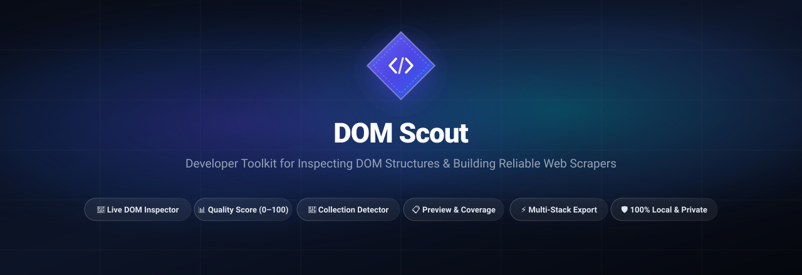
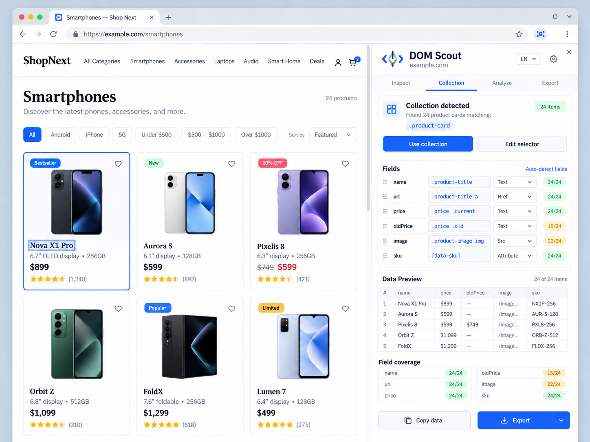
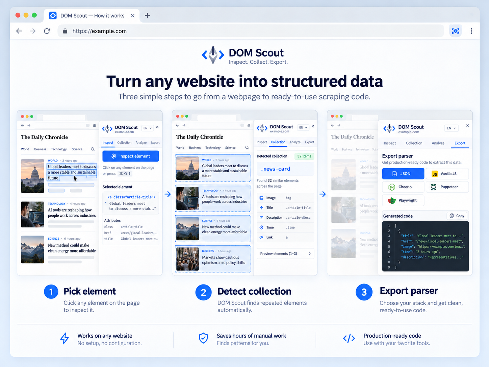
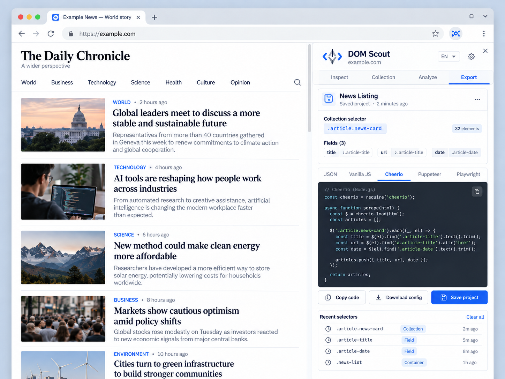

# DOM Scout — Web Scraping Companion, DOM Inspector & Selector Lab

<div align="center">

[](https://chrome.google.com/webstore)
[](https://developer.chrome.com/docs/extensions/mv3/intro/)
[](https://react.dev/)
[](https://vitejs.dev/)
[](tests/)
[](LICENSE)
[](#-privacy--security)

---

### Fast, lightweight, and 100% private in-browser Chrome Side Panel extension for inspecting page structures, generating resilient selectors, detecting repeating collections, and exporting scraper-ready code.

</div>

<br />

<p align="center">
  
</p>

<br />

---

## 📸 Visual Walkthrough & Screenshots

### 1. Element Inspection & Selector Quality Scoring

Point and click on any live DOM element to inspect tag hierarchies, view real-time dimensions, evaluate selector stability scores (0–100), and get clear rationale for recommended CSS & XPath selectors.

<p align="center">
  
</p>

---

### 2. Collection Detector & Relative Field Scoping

Automatically detect repeating card patterns across products and news lists, bind scoped child selectors (title, price, image, SKU), preview parsed table records, and monitor field coverage in real time.

<p align="center">
  
</p>

---

### 3. Page Analyzer, Meta Tags & Structured JSON-LD

Inspect canonical URLs, HTTP status, Open Graph, Twitter Cards, and explore nested JSON-LD schema entities (e.g. `NewsArticle`, `Product`, `Organization`) with one-click path and JSON copying.

<p align="center">
  
</p>

---

### 4. End-to-End Workflow: From Webpage to Scraping Code

Turn any website into structured data in three frictionless steps: Pick element → Detect collection → Export clean, production-ready code for your preferred automation runtime.

<p align="center">
  
</p>

---

### 5. Multi-Target Code Generation & Project Persistence

Generate tailored scraping scripts in one click for Cheerio (Node.js), Puppeteer, Playwright, Vanilla JavaScript, and raw Config JSON, with local project persistence for every visited domain.

<p align="center">
  
</p>

---

## 🚀 Key Highlights & Capabilities

- 🎯 **Interactive Element Inspector**: Point-and-click live DOM inspection with real-time bounding box highlights, element tag, classes, dimensions, and keyboard shortcuts (`⌥ + ⇧ + I` / `Alt + Shift + I`).
- 📊 **Intelligent Quality Scoring (0–100)**: Evaluates CSS and XPath selector stability using semantic class detection, ID validity, path depth penalties, and dynamic class hash filtering (CSS Modules, Tailwind, styled-components).
- 🧩 **Automated Collection Detection**: Identifies repeating ancestor container patterns (cards, lists, grids) across the page and automatically scopes child selectors to container boundaries.
- ⚡ **Auto-Detect Fields & Coverage**: Discovers common schema fields (`title`, `url`, `price`, `oldPrice`, `image`, `sku`, `date`) with real-time coverage meters (e.g., `24/24` or `18/24`) and duplicate alerts.
- 🌳 **Rich Metadata & JSON-LD Explorer**: Deep-analyzes page headers, Open Graph tags, Twitter metadata, and parses `<script type="application/ld+json">` into interactive collapsible JSON trees.
- 📦 **Multi-Stack Code Exporter**: Instant one-click code generation for **Config JSON**, **Vanilla JS**, **Cheerio (Node.js)**, **Puppeteer**, and **Playwright** with async/await syntax and error-handling boilerplate.
- 💾 **Local Project Persistence**: Automatically saves scraper schemas, collections, and custom selectors by domain in `chrome.storage.local` with recent selector history tracking.
- 🌍 **Multilingual by Design (i18n)**: Full runtime internationalization supporting English, Russian, and Ukrainian with instant switching without page reload.
- 🛡️ **100% Local & Privacy-First**: Operates strictly within your browser. No external backend servers, no cloud sync, no tracking, and zero telemetry.

---

## 📂 Feature & Tool Matrix

| Module / Tool | Core Functionality | Rules & Scope |
| :--- | :--- | :--- |
| **Inspect Tab** | Point-and-click element picker, dimension tooltips, CSS/XPath generator | Shadow DOM overlay, `selector-generator.js`, live DOM metrics |
| **Quality Scorer** | 0–100 score meter, hash class detection, stability heuristics & rationale | `selector-analyzer.js`, heuristic stability rules |
| **Collection Detector** | Sibling pattern matching, repeating parent detection, container scoping | `collection-detector.js`, tree ancestor clustering |
| **Data Preview** | Live data table, field coverage ratios, missing field & duplicate alerts | `extraction.js`, relative queries, deduplication logic |
| **Page Analyzer** | Meta tags, Open Graph, Twitter cards, JSON-LD structured data explorer | `page-analyzer.js`, `application/ld+json` parser |
| **Multi-Stack Exporter** | Code generator for Vanilla JS, Cheerio, Puppeteer, Playwright, JSON | `shared/exporters/*`, template compilation |
| **Project Manager** | Domain-based schema storage, saved projects, recent selector history | `chrome.storage.local`, versioned schema persistence |
| **i18n Language Switcher** | Runtime translation engine supporting English, Russian, and Ukrainian | Local dictionary JSON files (`en`, `ru`, `uk`) |

---

## 🔒 Privacy & Security

DOM Scout is built with an uncompromising **Privacy-First** standard:

1. **100% Client-Side Processing**: All DOM traversals, selector evaluations, and data extractions run strictly inside Chrome's Manifest V3 sandbox and content script.
2. **Zero Remote Servers & Zero Telemetry**: The extension contains no analytics, no trackers, and makes zero network requests to external endpoints.
3. **No Account Required**: Ready to use immediately upon installation without registration, login, or API keys.
4. **No Cloud Sync (`chrome.storage.sync` strictly disabled)**: All settings, saved scraper projects, and selector history are stored exclusively on your device using `chrome.storage.local`.
5. **Non-Intrusive DOM Overlay**: The inspector uses an isolated Shadow DOM container with distinct z-indexing, ensuring host page styles never collide or mutate the target page's layout.

---

## 🛠️ Architecture & Tech Stack

- **Manifest V3**: Modular Service Worker (`src/background/service-worker.js`) and Side Panel registration (`chrome.sidePanel`).
- **React 18 & Vite 6**: Lightning-fast compilation and reactive Side Panel application with Lucide Icons.
- **Pure JavaScript Core**: ES Modules for Side Panel & Service Worker, IIFE for Content Script.
- **Isolated Shadow DOM**: Non-intrusive hover inspector overlay without CSS leakage.
- **Vitest 3**: 27 unit tests verifying selector scoring, collection detection, exporters, i18n, and storage.

```text
dom-scout-chrome-extension/
├── public/
│   ├── manifest.json              # Manifest V3 extension configuration
│   ├── icons/                     # Extension icons (16, 48, 128px)
│   └── _locales/                  # Web Store manifest localizations (en, ru, uk)
├── src/
│   ├── background/
│   │   └── service-worker.js      # Side panel registration & lifecycle
│   ├── content/
│   │   ├── index.js               # Content script entrypoint & message dispatcher
│   │   ├── inspector.js           # Hover inspection, element selection, key handling
│   │   ├── highlighter.js         # Non-intrusive Shadow DOM overlay
│   │   ├── selector-generator.js  # CSS & XPath candidate generation
│   │   ├── selector-analyzer.js   # Quality scoring (0–100) & dynamic class heuristics
│   │   ├── collection-detector.js # Ancestor repeated structures detection
│   │   ├── extraction.js          # Relative data extraction & coverage analysis
│   │   └── page-analyzer.js       # Metadata, OpenGraph & JSON-LD parser
│   ├── sidepanel/
│   │   ├── index.html             # Side panel HTML entrypoint
│   │   ├── main.jsx               # React 18 root mount
│   │   ├── App.jsx                # Application controller & state machine
│   │   ├── components/            # Reusable UI (Header, Tabs, Badge, Toast, ScoreMeter)
│   │   ├── features/              # InspectTab, CollectionTab, AnalyzeTab, ExportTab, SettingsModal
│   │   └── styles/                # CSS custom properties, tokens, and component stylesheets
│   └── shared/
│       ├── constants/             # Message types & extraction constants
│       ├── i18n/                  # Dictionaries (en, ru, uk) & translation helper
│       ├── storage/               # Versioned chrome.storage.local repository wrapper
│       └── exporters/             # Code generators (JSON, Vanilla, Cheerio, Puppeteer, Playwright)
├── assets/
│   ├── banner.svg                 # Project hero banner
│   └── screenshots/               # Application UI walkthrough screenshots
├── docs/
│   ├── DOM_SCOUT_AI_AGENT_TASK.md # Detailed technical specification
│   └── assets/                    # Reference screenshots
├── scripts/
│   ├── build.js                   # Multi-entry build orchestrator
│   ├── generate-banner.js         # SVG hero banner generator
│   └── generate-icons.js          # Pure Node.js icon generator
├── tests/
│   ├── fixtures/                  # HTML test fixtures (news-list.html, product-list.html)
│   └── unit/                      # Vitest unit test suite (27 tests)
├── package.json
└── vite.config.js
```

---

## 💻 Development & Build Instructions

### Prerequisites

- **Node.js** >= 18.0.0 (tested on Node.js 20 & 22)
- **npm** >= 9.0.0

### 1. Clone & Install

```bash
git clone https://github.com/Solod-S/dom-scout-chrome-extension.git
cd dom-scout-chrome-extension
npm install
```

### 2. Run Tests

```bash
npm test
```

Runs all unit tests with Vitest:

```text
 ✓ tests/unit/storage.test.js (3 tests)
 ✓ tests/unit/selector-score.test.js (9 tests)
 ✓ tests/unit/collection.test.js (5 tests)
 ✓ tests/unit/i18n.test.js (5 tests)
 ✓ tests/unit/exporters.test.js (5 tests)

 Test Files  5 passed (5)
      Tests  27 passed (27)
```

### 3. Build Production Extension

```bash
npm run build
```

Compiles all Side Panel React components, Content Script (IIFE), and Service Worker into `dist/`.

---

## 🚀 Loading Unpacked Extension into Chrome

1. Open Google Chrome and navigate to `chrome://extensions/`.
2. Enable the **Developer mode** toggle in the top-right corner.
3. Click the **Load unpacked** button in the top-left corner.
4. Select the `dist/` directory inside this project folder.
5. Click the **DOM Scout** icon in your Chrome toolbar (or press `⌥ + ⇧ + D` / `Alt + Shift + D`) to open the Side Panel. Pin it for instant access!

---

## 🧭 User Guide & Keyboard Shortcuts

| Shortcut (macOS) | Shortcut (Windows / Linux) | Action |
| :--- | :--- | :--- |
| `⌥ + ⇧ + D` | `Alt + Shift + D` | Open / Toggle DOM Scout Side Panel |
| `⌥ + ⇧ + I` | `Alt + Shift + I` | Toggle Element Inspector Mode |
| `Esc` | `Esc` | Exit Element Inspector |

### Step-by-Step Workflow

1. **Inspect Elements**: Click **Inspect element** or press `⌥ + ⇧ + I`. Hover over any element on the webpage to see real-time bounding boxes and dimensions. Click to select the target element.
2. **Review Selectors**: Examine the **Recommended selector**, **Alternative selectors**, live DOM match count, stability score (0–100), and rationale breakdown.
3. **Detect Collections**: When selecting an item inside a repeating card or listing, switch to or activate the **Collection** tab to detect parent container patterns.
4. **Auto-Detect Fields**: Click **Auto-detect fields** to automatically bind relative child selectors for title, URL, price, date, image, or SKU.
5. **Verify Data & Coverage**: Check the **Data Preview** table and verify coverage ratios (e.g. `24/24` or `18/24`) before generating scraper code.
6. **Analyze Page Metadata**: Switch to the **Analyze** tab to inspect canonical URLs, Open Graph, Twitter Cards, and explore JSON-LD structured data trees.
7. **Export Scraper Code**: Switch to the **Export** tab and select your preferred target runtime (**Vanilla JS**, **Cheerio**, **Puppeteer**, **Playwright**, or **JSON**). Click **Copy code**, **Download config**, or **Save project** to persist your schema.

---

## 🗺️ Roadmap

### Phase 2 (Advanced Developer Tools)
- 🌐 **DevTools Network Inspector**: Capture background Fetch/XHR endpoints and inspect API response payloads.
- ⚡ **API Candidate Auto-Detection**: Identify backend JSON / GraphQL endpoints matching rendered DOM cards.
- 🔄 **Live Mutation Monitor**: Track dynamic price changes, DOM updates, and DOM insertions via `MutationObserver`.
- 🩺 **Selector Health Monitor**: Periodic health check of saved project selectors against target websites.
- 📜 **Pagination & Infinite Scroll Heuristics**: Auto-discovery of "Next" buttons, pagination parameters, and scroll boundaries.

### Phase 3 (AI-Assisted Scraping)
- 🤖 **Local AI Selector Healing**: Propose automated selector repairs when target website markup changes.

---

## 📄 License

This project is open-source and licensed under the [MIT License](LICENSE).
